# VedNN — A NumPy-only Neural Network Framework

## Overview

**VedNN** is a neural network framework built entirely with NumPy — no PyTorch, no TensorFlow, no JAX. Built to demystify backpropagation, verify every gradient numerically, and iterate on architecture decisions with full transparency. Targets 98%+ accuracy on MNIST through rigorous hyperparameter sweeps and ablation studies.

## Project Structure

```
vednn/
├── nn/                         # framework core
│   ├── __init__.py             # public API exports
│   ├── layer.py                # Dense, ReLU, Sigmoid, Dropout
│   ├── loss.py                 # MSE, SoftmaxCrossEntropy
│   ├── optimizer.py            # SGD (momentum), Adam
│   └── network.py              # Network (forward/backward/compile/fit/evaluate)
├── data/
│   ├── __init__.py
│   └── datasetloader.py        # MNIST download, split, batching
├── test/
│   └── test_main.py            # 28 unit tests
├── experiments/
│   ├── 01_baseline/
│   ├── 02_learning_rate/
│   ├── 03_optimizer/
│   ├── 04_width_scaling/
│   ├── 05_depth_scaling/
│   ├── 06_dropout_ablation/
│   ├── 07_weight_init/
│   └── 08_seed_stability/
├── pyproject.toml
└── README.md
```

## Implemented Components

| Module         | Components                                                     |
|----------------|----------------------------------------------------------------|
| Layers         | Dense (fully-connected)                                        |
| Activations    | ReLU, Sigmoid                                                  |
| Losses         | MSE, SoftmaxCrossEntropy                                       |
| Optimizers     | SGD, SGD with Momentum, Adam                                   |
| Regularization | Dropout (inverted dropout with scaling)                        |
| Initialization | Xavier, He                                                     |
| Network        | forward, backward, compile, fit, evaluate                      |

## Testing

**28 unit tests — 100% passing.**

- **Numerical gradient verification** — every layer, loss, and end-to-end network gradient is checked against finite-difference approximations (`EPS=1e-5`, `ATOL=1e-6`)
- **Dense layer** — forward shape/value, gradient fidelity, init scheme correctness
- **Activations** — ReLU/Sigmoid forward values, gradient checks, numerical stability (sigmoid on ±1000 inputs)
- **Losses** — MSE and SoftmaxCrossEntropy forward values and gradients, large-logit stability
- **Dropout** — eval identity, zero-rate identity, train/eval difference, mask scaling, backward mask reuse, invalid rate rejection
- **Optimizers** — SGD parameter updates, momentum velocity tracking, Adam updates and internal state (`t`, `_m`, `_v`)
- **End-to-end** — full-network gradient check on 4-layer MLP; synthetic learning test parametrized over Adam, SGD, SGD+Momentum (converges to 90%+ accuracy); evaluate API boundary checks

```bash
uv run pytest -v
```

## Experimental Evaluation

### Baseline

First model to establish a starting point before any optimization.

**Architecture:** `784-256-128-10` | **Optimizer:** Adam | **LR:** 1e-3 | **Epochs:** 10

| Metric          | Value    |
|-----------------|----------|
| Train Accuracy  | 99.63%   |
| Val Accuracy    | 97.63%   |
| Test Accuracy   | 97.91%   |
| Parameters      | 235,146  |
| Training Time   | 58.3s    |

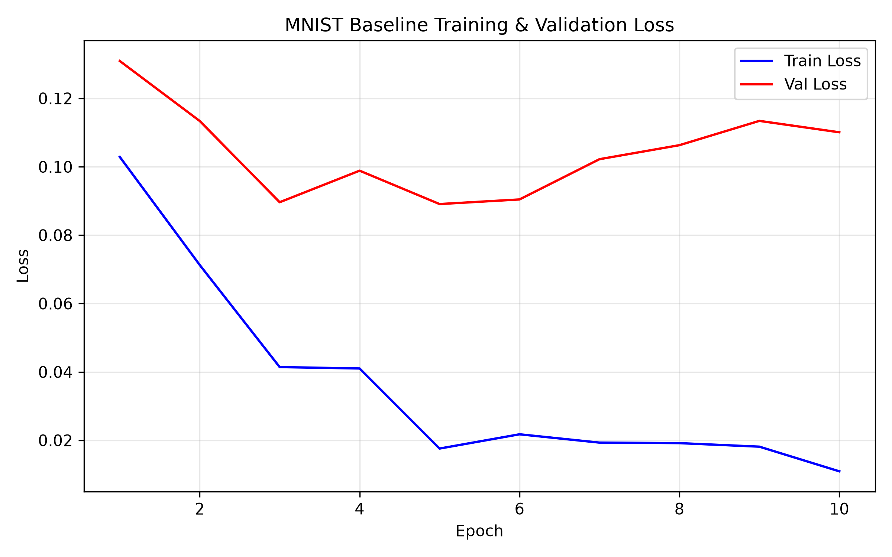
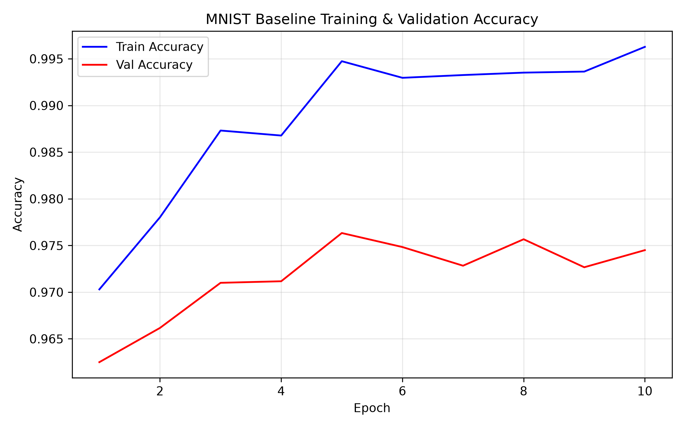

---

### Learning Rate Sweep

Tested 6 learning rates from 1e-4 to 3e-2 with Adam. Peak performance at **3e-4**.

| LR     | Best Val Acc | Test Acc  |
|--------|-------------|-----------|
| 1e-4   | 96.97%      | 97.29%    |
| **3e-4** | **97.67%** | **97.80%** |
| 1e-3   | 97.63%      | 97.91%    |
| 3e-3   | 97.62%      | 97.94%    |
| 1e-2   | 96.53%      | 96.60%    |
| 3e-2   | 93.77%      | 92.67%    |

**Findings:** LR=3e-4 achieves the highest validation accuracy. At 1e-2 and above, training becomes unstable — loss fails to converge and accuracy degrades sharply.

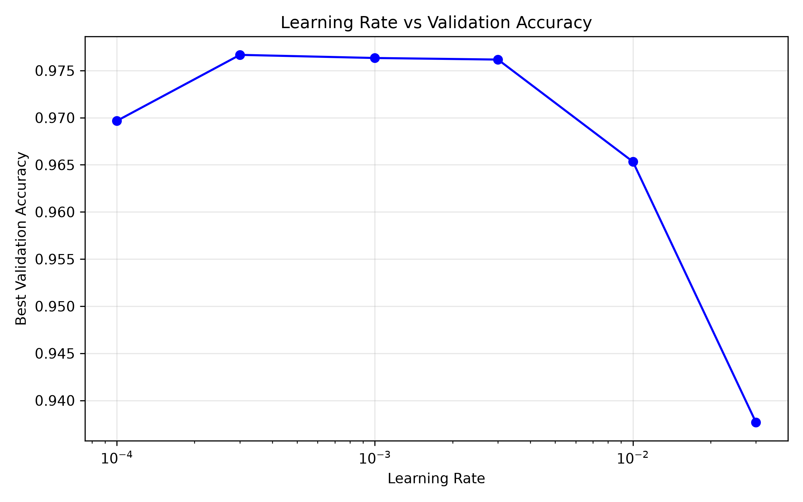
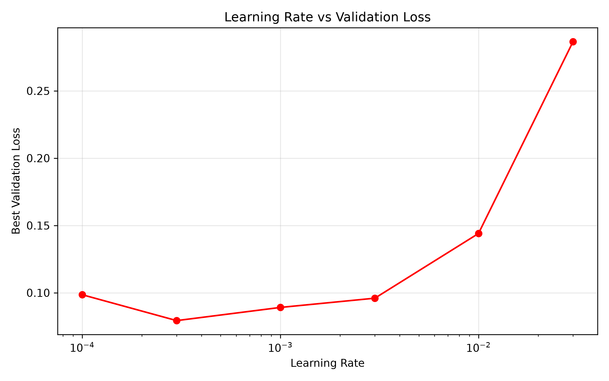

---

### Optimizer Comparison

Compared SGD (lr=0.001), SGD+Momentum (0.9), and Adam head-to-head.

| Optimizer | Best Val Acc | Test Acc  | Time   |
|-----------|-------------|-----------|--------|
| SGD       | 88.97%      | 90.07%    | 32.5s  |
| Momentum  | 94.70%      | 95.14%    | 55.1s  |
| **Adam**  | **97.63%**  | **97.91%** | 55.2s  |

**Findings:** Adam dominates — +8.7% over SGD and +2.9% over Momentum on validation accuracy. SGD without momentum stalls on this architecture. Momentum helps (+5.7%), but adaptive learning rates are necessary to reach 97%+.

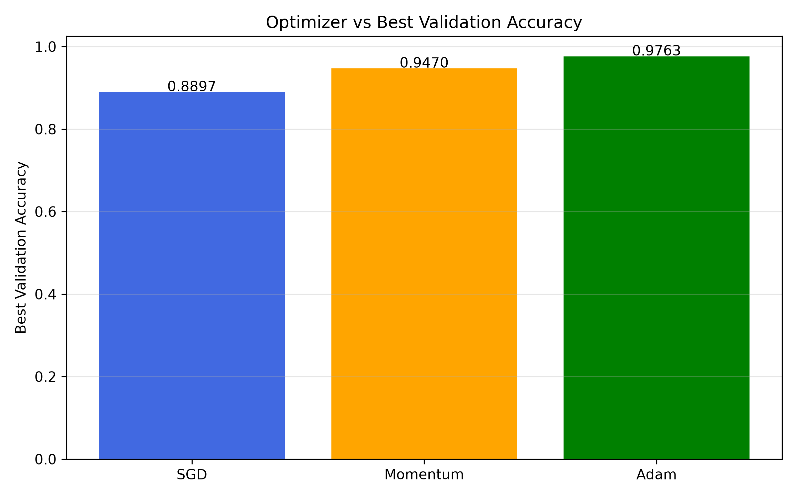
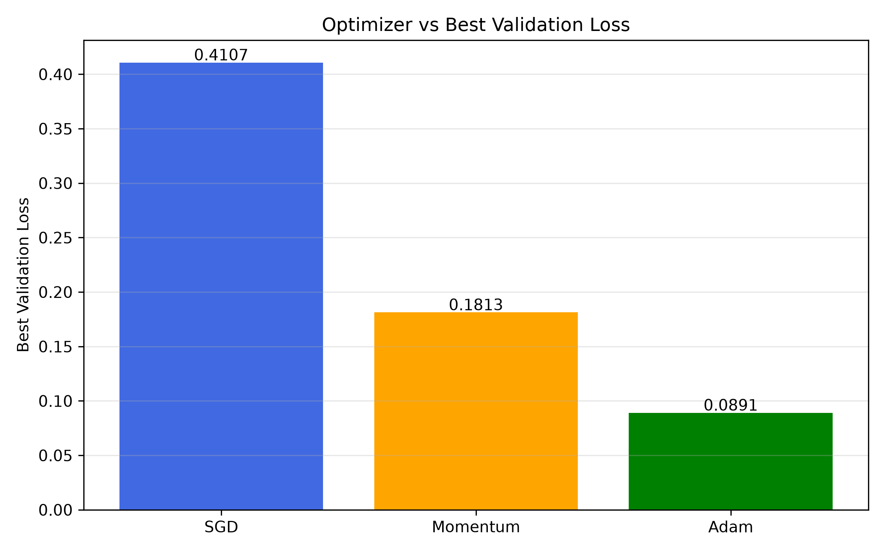

---

### Width Scaling

Varying hidden layer width from 32-16 to 512-256 (2 hidden layers, Adam, lr=1e-3).

| Width    | Parameters | Best Val Acc |
|----------|-----------|-------------|
| 32-16    | 25,818    | 96.50%      |
| 64-32    | 52,650    | 97.13%      |
| 128-64   | 109,386   | 97.65%      |
| **256-128** | **235,146** | **97.63%**  |
| 512-256  | 535,818   | 97.80%      |

**Findings:** Accuracy saturates around 256-128. Doubling parameters to 512-256 yields only +0.17% improvement while increasing compute cost by 2x (105s vs 52s). The sweet spot is 128-64 or 256-128.

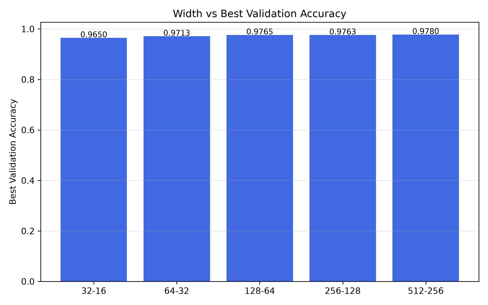
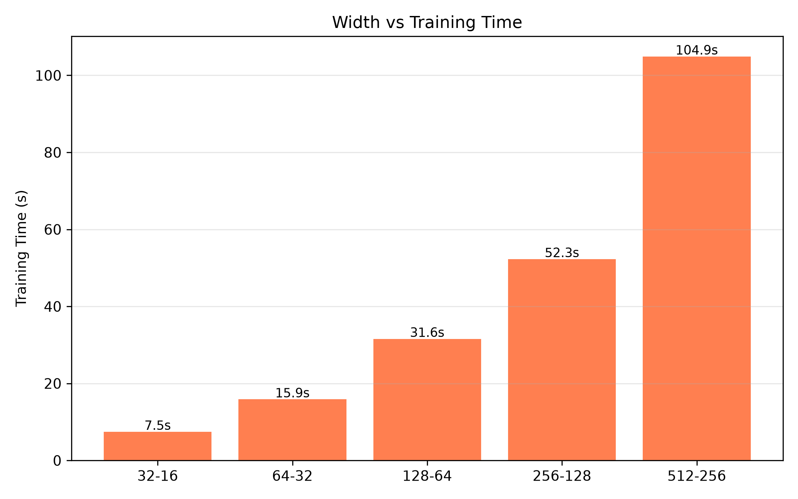
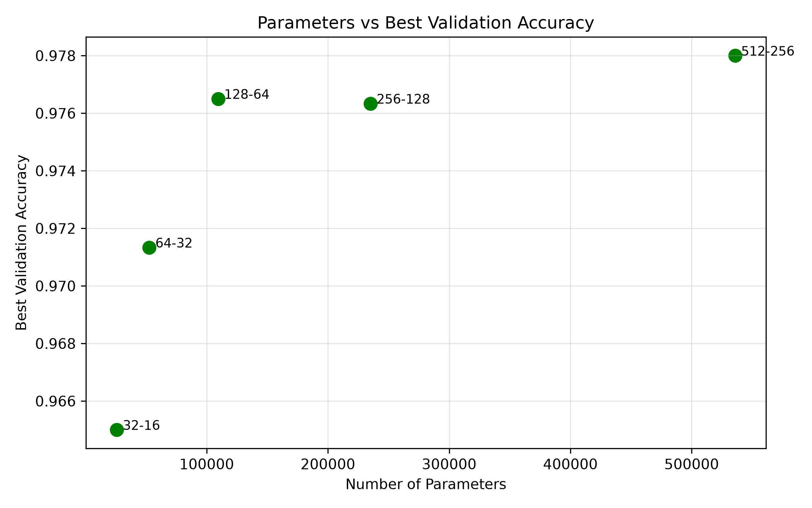

---

### Depth Scaling

Varying depth from 1 to 5 hidden layers (width=128 fixed, Adam, lr=1e-3).

| Hidden Layers | Parameters | Best Val Acc |
|--------------|-----------|-------------|
| **1**        | **101,770** | **97.80%**  |
| 2            | 118,282   | 97.75%      |
| 3            | 134,794   | 97.60%      |
| 4            | 151,306   | 97.45%      |
| 5            | 167,818   | 97.55%      |

**Findings:** Deeper is not better. A single hidden layer (128 units) achieves the highest validation accuracy at the lowest parameter count. Additional layers introduce optimization difficulty — vanishing gradients and harder credit assignment outweigh the benefit of increased capacity for this MNIST MLP.

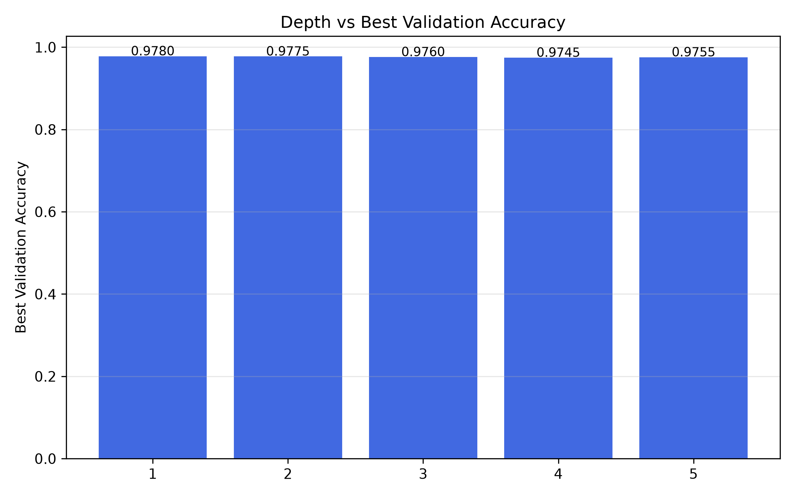
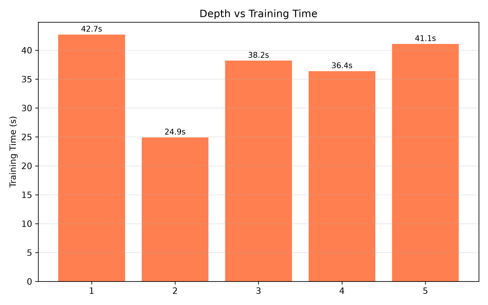
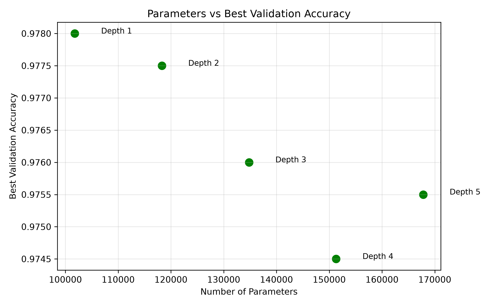

---

### Dropout Ablation

Applied dropout after every hidden layer's activation (not on output). Architecture: 256-128, Adam, lr=1e-3.

| Dropout | Best Val Acc | Test Acc  |
|---------|-------------|-----------|
| 0.0     | 97.63%      | 97.91%    |
| 0.1     | 97.82%      | 98.10%    |
| **0.2** | **98.10%**  | **98.29%** |
| 0.3     | 97.90%      | 98.04%    |
| 0.5     | 97.45%      | 97.73%    |

**Findings:** Dropout=0.2 provides the best regularization — validation accuracy improves +0.47% over no dropout, and test accuracy reaches 98.29% (the highest of any experiment). At 0.5, underfitting occurs as too many units are dropped during training.

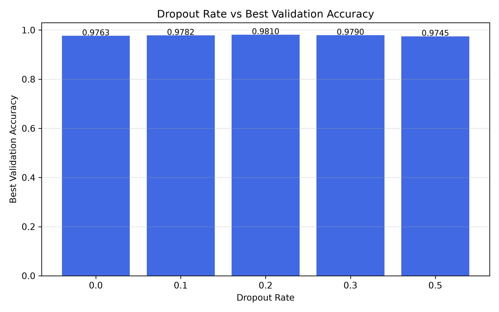
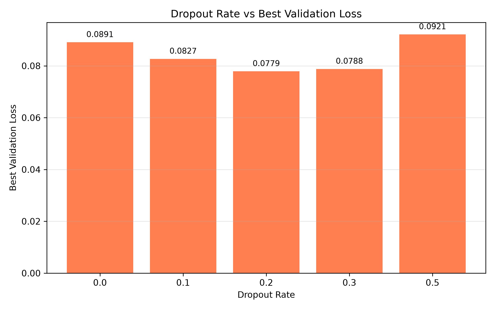

---

### Weight Initialization

Comparing Xavier (Glorot) vs He initialization with dropout=0.2.

| Init   | Best Val Acc | Test Acc  |
|--------|-------------|-----------|
| Xavier | 98.10%      | **98.29%** |
| He     | **98.10%**  | 98.29%    |

**Findings:** Both initializations produce identical accuracy. With ReLU activation and moderate dropout, the choice between Xavier and He has negligible impact on this architecture and dataset.

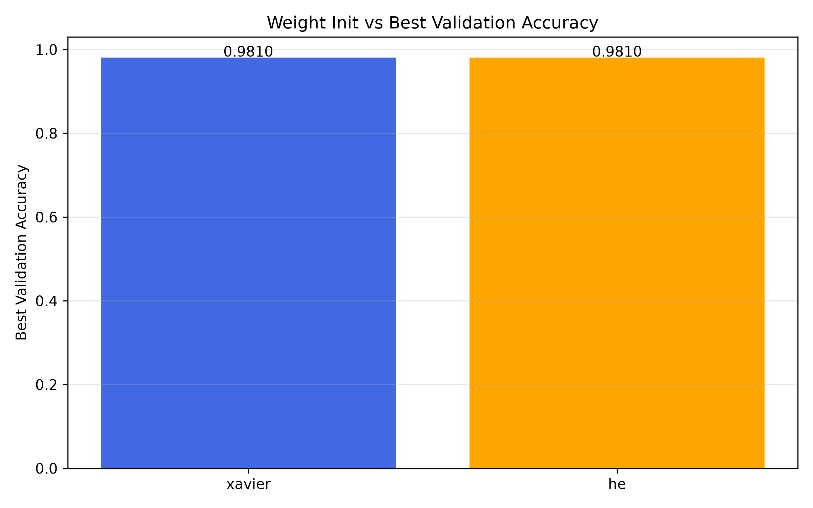
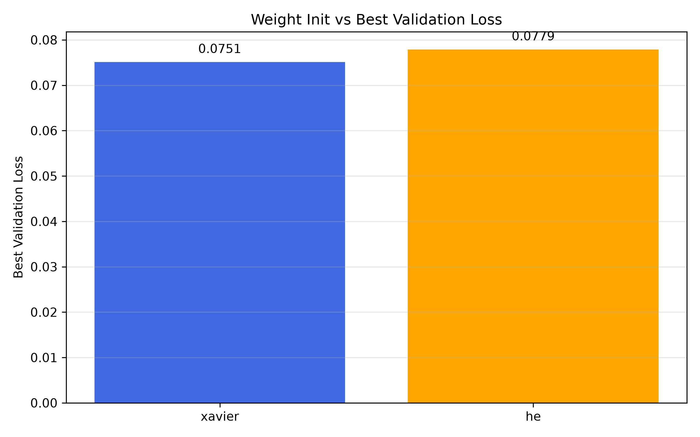

---

### Seed Stability

Trained the best configuration across 5 random seeds.

**Config:** Architecture=256-128, Adam, LR=3e-4, Dropout=0.2, Xavier init, Epochs=20

| Seed | Test Accuracy |
|------|--------------|
| 0    | 98.30%       |
| **21** | **98.27%**  |
| 42   | 98.22%       |
| 123  | 98.27%       |
| 999  | 98.23%       |

| Metric      | Value         |
|-------------|---------------|
| Mean Val    | 98.13% ± 0.13%|
| **Mean Test** | **98.26% ± 0.03%** |
| Best Seed   | 21 (98.30%)   |

**Findings:** The model is highly stable — test accuracy varies by only ±0.03% across seeds. This confirms that the chosen hyperparameters reliably produce 98.2%+ test accuracy.

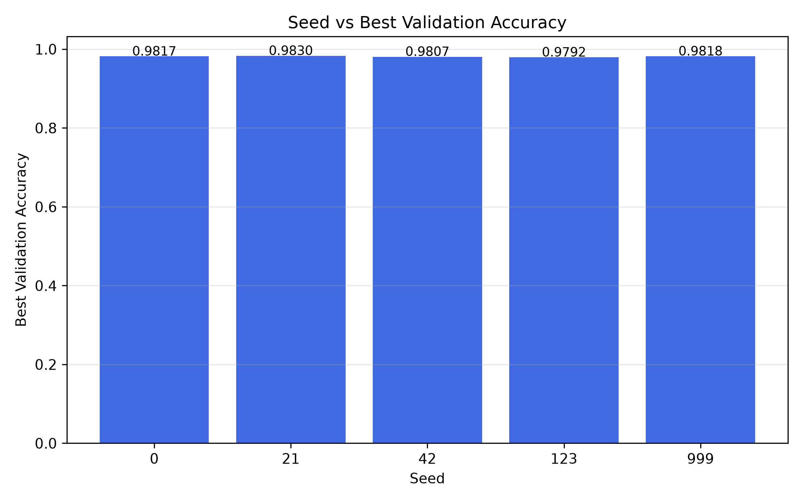
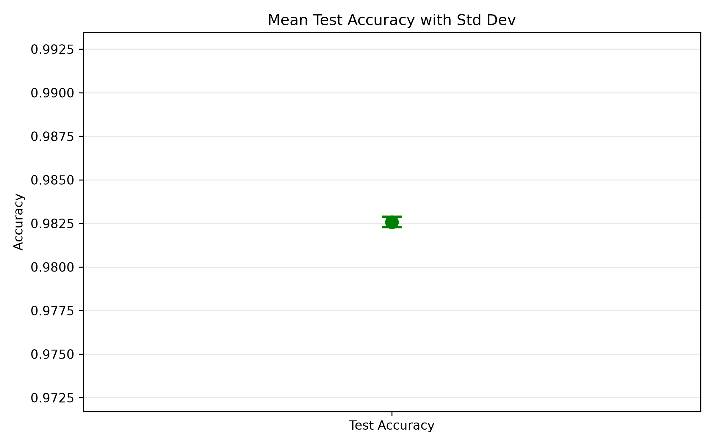

## Experimental Summary

| Experiment        | Best Configuration   | Result              |
|-------------------|----------------------|---------------------|
| Baseline          | 256-128, Adam, 1e-3  | 97.91% test         |
| Learning Rate     | 3e-4                 | 97.80% test         |
| Optimizer         | Adam                 | 97.91% test         |
| Width             | 256-128              | 97.63% val          |
| Depth             | 1 hidden layer       | 97.80% val          |
| Dropout           | 0.2                  | 98.29% test         |
| Initialization    | Xavier / He          | 98.29% test         |
| Seed Stability    | σ = 0.03%            | 98.26% ± 0.03% test |

## Key Findings

- **Adam consistently outperformed SGD** by +8.7% validation accuracy and SGD+Momentum by +2.9%
- **Optimal learning rate of 3e-4** — rates at 1e-2+ cause training instability and degradation
- **Width improved up to 256-128** before saturating; 512-256 added only +0.17% at 2x compute cost
- **Increasing depth beyond 1 hidden layer produced diminishing returns** — a single 128-unit layer matched or beat all deeper variants
- **Moderate dropout (0.2) improved test accuracy** by +0.38% over no dropout (98.29% vs 97.91%)
- **Xavier and He produced identical performance** — initialization choice is not critical with ReLU + dropout
- **Training is highly stable across seeds** — ±0.03% test accuracy std over 5 runs (98.24%–98.30%)

## Performance

| Metric             | Value              |
|--------------------|--------------------|
| Best Test Accuracy | 98.30%             |
| Mean Test Accuracy | 98.26%             |
| Test Std           | ±0.03%             |
| Parameters         | 235,146            |
| Training Time      | ~120s (20 epochs)  |

## Limitations

- CPU-only training (no GPU backend)
- Feedforward MLP only — no convolutions, no recurrence, no attention
- No BatchNorm, LayerNorm, or other normalization layers
- No learning rate scheduling (constant LR only)
- No model checkpointing / save-load
- Single dataset (MNIST) — not tested on CIFAR, ImageNet, etc.
- No mixed precision or numerical optimization

## Installation

```bash
git clone https://github.com/yourusername/vednn
cd vednn
uv sync
```

MNIST data is downloaded automatically on first `load_data()` call and cached as `data/mnist.npz`.

## Usage

### Run all experiments

```bash
# Baseline
uv run python experiments/01_baseline/baseline.py

# Learning rate sweep
uv run python experiments/02_learning_rate/learning_rate.py

# Optimizer comparison
uv run python experiments/03_optimizer/optimizer.py

# Width scaling
uv run python experiments/04_width_scaling/width_scaling.py

# Depth scaling
uv run python experiments/05_depth_scaling/depth_scaling.py

# Dropout ablation
uv run python experiments/06_dropout_ablation/dropout_ablation.py

# Weight initialization
uv run python experiments/07_weight_init/weight_init.py

# Seed stability
uv run python experiments/08_seed_stability/seed_stability.py
```

### Run tests

```bash
uv run pytest test/ -v
```

### Use the framework

```python
from nn import Network, Dense, ReLU, Dropout, SoftmaxCrossEntropy, Adam
from data import load_data

# Load MNIST
(x_train, y_train), (x_val, y_val), (x_test, y_test) = load_data(seed=42)

# Build model
net = Network()
net.add(Dense(784, 256, weight_init="xavier", seed=42))
net.add(ReLU())
net.add(Dropout(rate=0.2, seed=42))
net.add(Dense(256, 128, weight_init="xavier", seed=42))
net.add(ReLU())
net.add(Dropout(rate=0.2, seed=42))
net.add(Dense(128, 10, weight_init="xavier", seed=42))

# Compile
net.compile(loss=SoftmaxCrossEntropy(), optimizer=Adam(lr=3e-4))

# Train
history = net.fit(x_train, y_train, epochs=10, batch_size=64,
                  validation_data=(x_val, y_val), seed=42)

# Evaluate
test_loss, test_acc = net.evaluate(x_test, y_test)
print(f"Test Accuracy: {test_acc * 100:.2f}%")
```

## References

- [CS231n: Convolutional Neural Networks for Visual Recognition](http://cs231n.stanford.edu/) — Stanford course that inspired the from-scratch approach
- [Deep Learning (Goodfellow, Bengio, Courville)](https://www.deeplearningbook.org/) — foundational reference on backpropagation and optimization
- [Adam: A Method for Stochastic Optimization (Kingma & Ba, 2014)](https://arxiv.org/abs/1412.6980) — adaptive optimizer used in all experiments
- [Understanding the Difficulty of Training Deep Feedforward Neural Networks (Glorot & Bengio, 2010)](http://proceedings.mlr.press/v9/glorot10a.html) — Xavier initialization
- [Delving Deep into Rectifiers: Surpassing Human-Level Performance on ImageNet (He et al., 2015)](https://arxiv.org/abs/1502.01852) — He initialization
- [Dropout: A Simple Way to Prevent Neural Networks from Overfitting (Srivastava et al., 2014)](https://www.cs.toronto.edu/~hinton/absps/JMLRdropout.pdf) — regularization technique
- [An Overview of Gradient Descent Optimization Algorithms (Ruder, 2016)](https://arxiv.org/abs/1609.04747) — survey of SGD variants, momentum, and Adam
- [Neural Networks and Deep Learning (Nielsen)](http://neuralnetworksanddeeplearning.com/) — accessible online book on NumPy-based neural networks
- [miniflux / micrograd (Karpathy)](https://github.com/karpathy/micrograd) — inspired the minimal-autograd philosophy
