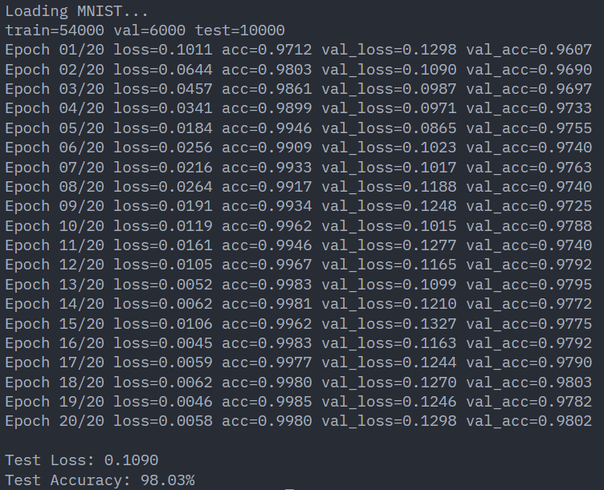
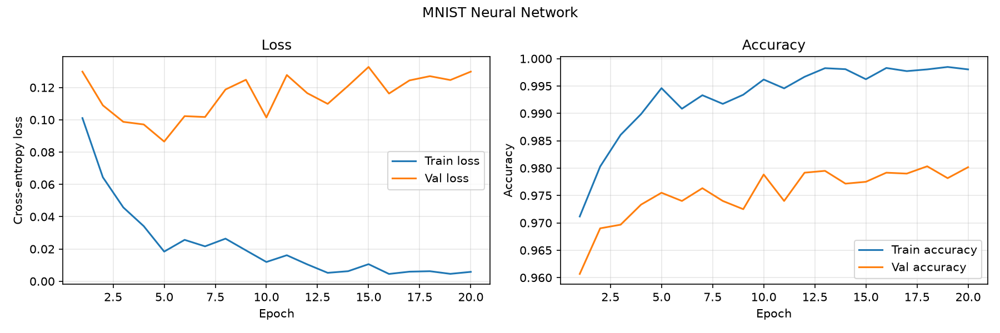

# vednn - a NumPy-only neural network framework

Tiny neural net from scratch because apparently importing PyTorch was too easy.

`vednn` is a NumPy-only neural network that trains on MNIST. It is not trying to be TensorFlow. It is trying to show the math, the training loop, and the pain in a clean little package.

## What is implemented

- Dense/fully-connected layers
- ReLU activation
- Softmax output
- Cross-entropy loss
- Mini-batch training
- Adam optimizer
- MNIST downloader/loader
- Train/validation/test split
- Accuracy + loss reporting per epoch

No deep learning framework. Just NumPy on steroids.

## Model architecture

Current architecture lives in `train.py` inside `build_network()`:

```python
Network()
    .add(Dense(784, 128))
    .add(ReLU())
    .add(Dense(128, 64))
    .add(ReLU())
    .add(Dense(64, 10))
    .add(Softmax())
```

MNIST images are `28x28`, so they get flattened into `784` inputs.
The output has `10` neurons because digits go from `0` to `9`.

Why this architecture is good enough:

- `784 -> 256 -> 128 -> 10` is small, fast, and easy to understand.
- ReLU keeps training simple and avoids boring saturation drama.
- Two hidden layers are enough to learn MNIST well without turning this into a GPU rent payment.
- Softmax gives class probabilities for the final digit prediction.

## Metrics

The model prints train/val loss and accuracy every epoch, because watching numbers go down is half the dopamine.

Terminal run screenshot:



I also plot the training curves with Matplotlib while training. `train.py` uses the `history` returned by `Network.fit()` to graph:

- train loss vs val loss
- train accuracy vs val accuracy

The generated plot gets saved into the `assets` folder as `plot.png`:



```text
train=54000 val=6000 test=10000
Epochs: 20
Final train loss: 0.0058
Final train acc: 0.9980
Final val loss: 0.1298
Final val acc: 0.9802

Test Loss: 0.1090
Test Accuracy: 98.03%
```

So yeah, the tiny NumPy gremlin learned MNIST pretty well.

## How to run

Install deps with `uv` first if needed:

```bash
uv sync
```

Download/check MNIST once:

```bash
uv run datasetloader.py
```

This downloads `mnist.npz` into the project folder. First time only.

Train the model:

```bash
uv run train.py
```

## How to customize

### Change the model layers

Edit `build_network()` in `train.py`:

```python
def build_network():
    return (
        Network()
        .add(Dense(784, 256, seed=SEED))
        .add(ReLU())
        .add(Dense(256, 128, seed=SEED))
        .add(ReLU())
        .add(Dense(128, 10, seed=SEED))
        .add(Softmax())
    )
```

Just keep the first layer input as `784` and the final output as `10` for MNIST.

### Change training parameters

Edit these constants in `train.py`:

```python
EPOCHS = 20
BATCH_SIZE = 64
LEARNING_RATE = 0.001
```

Try:

- More epochs = maybe better accuracy, maybe overfitting, definitely more waiting.
- Bigger batch size = faster sometimes, less noisy updates.
- Smaller learning rate = slower but steadier.
- Larger learning rate = spicy, may explode.

## Files

```text
src/nn.py             neural net layers, loss, optimizer, training loop
src/datasetloader.py  MNIST download + preprocessing
src/train.py          model architecture + training config
assets/               saved terminal output, generated plots
```
